# NeckEase 頸智鬆 - 實體裝置 neGuard

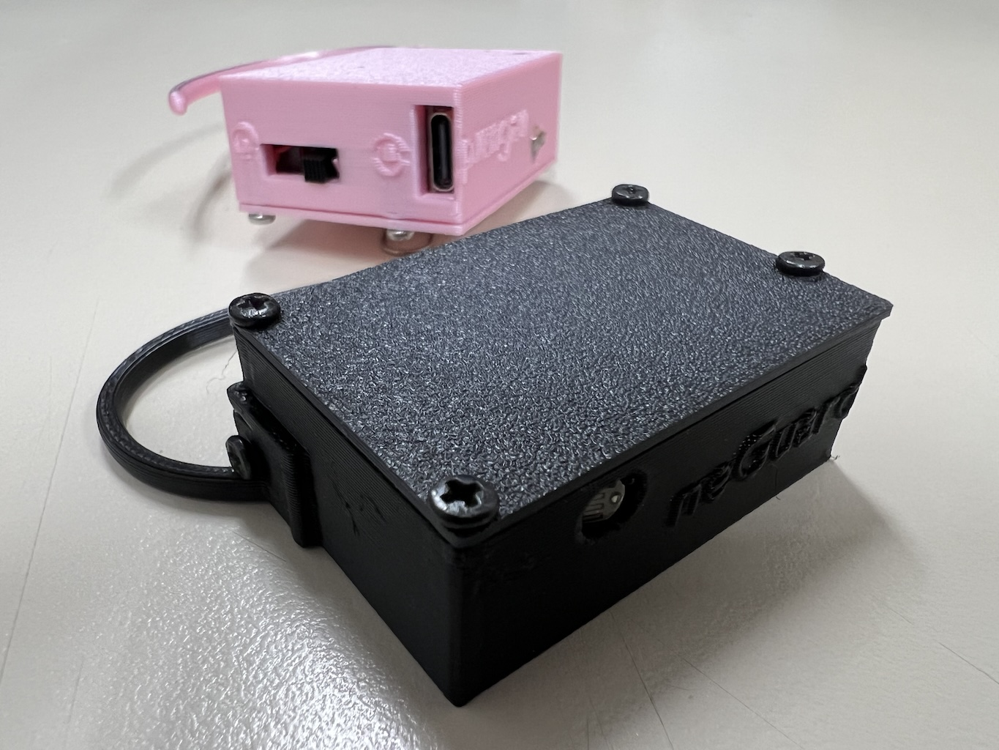

📖 簡介
neGuard 是一個基於 ESP32-C3 的智慧姿勢矯正裝置。它能透過 BLE 與「NeckEase 頸智鬆」手機應用程式配對設定，之後便能離線獨立運作，即時監測你的頭部角度。當偵測到不良姿勢（如「烏龜頸」）過久時，neGuard 會以震動提醒，幫助你養成良好的姿勢習慣。

本專案專為 DIY 愛好者 及 STEAM 教育 設計，所有零件、程式碼和 3D 列印檔案皆已開源。我們希望藉此啟發對科技有興趣的同學，能一步一腳印地參考實踐，進而發揮創意，發明更多有益他人的作品。

✨ 功能特色
姿勢即時監測：內建 MPU-6050 陀螺儀，精準偵測頭部前傾角度。

離線獨立運作：與手機配對設定後，即可獨立使用，無需持續連接手機。

震動即時提醒：當姿勢不良時間超過設定值，內建震動馬達會溫和提醒。

低功耗藍牙 (BLE)：使用 ESP32-C3 的 BLE 功能，與手機應用程式進行配對與設定。

DIY 友善設計：採用常見、易於取得的電子零件，搭配 3D 列印外殼，組裝簡單。

** 與應用程式配對及設定之後，neGuard 保留參數儲存到 EEPROM，neGuard 開機30秒後會停止藍牙功能節省電力。如改動「角度閾值」和「持續時間」，在neGuard開機30秒內打開手機應用程式重新設定。 **

🧩 硬體需求
以下是製作 neGuard 所需的完整零件清單：
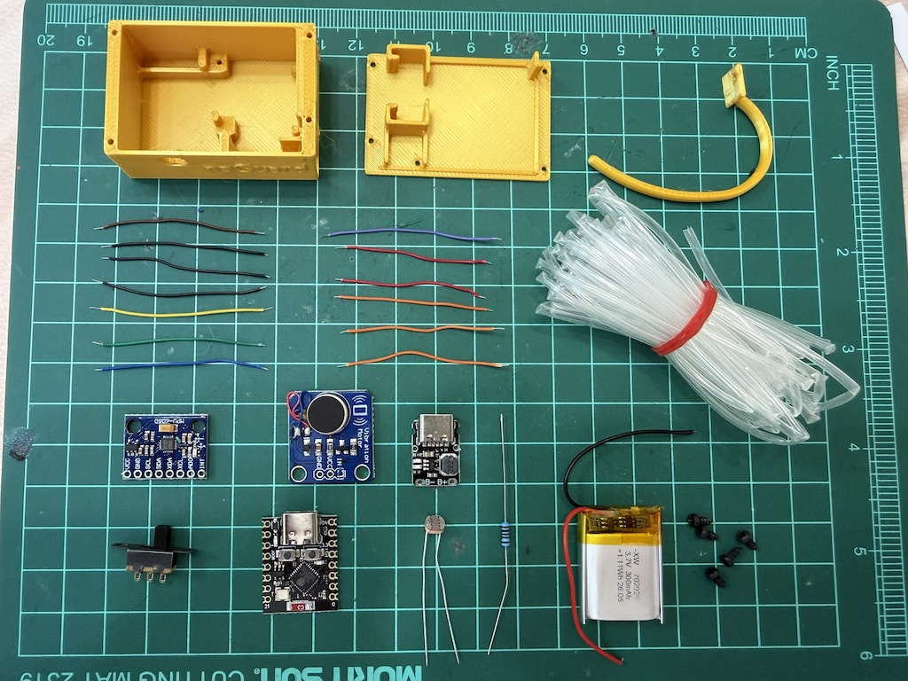
### 硬體需求清單

- **微控制器**：ESP32-C3 Supermini 開發板 × 1（核心運算單元，支援 BLE）
- **陀螺儀**：MPU-6050 (I2C) × 1（偵測頭部角度）
- **光敏電阻**：5549 × 1（用於判斷環境光照度）
- **電阻**：10kΩ × 1（配合光敏電阻使用）
- **震動馬達模組**：1020 扁平震動馬達 × 1（提供震動提醒）
- **鋰電池充電模組**：5V 充電模組 (Type-C) × 1（為鋰電池充電）
- **電源開關**：SS-12F15 3腳2檔 滑動開關 × 1（控制裝置電源）
- **鋰電池**：702025 3.7V 300mAh LiPo × 1（裝置電源）
- **連接線**：AWG26 杜邦線/軟矽膠線（用於電路連接）
- **熱縮通**：少量(絕緣，避免短路)
- **螺絲**：M2x5不鏽鋼自攻螺絲 x 5

🔧 組裝與設定指南
1. 電路連接 (接線圖)
請參考以下接線圖進行焊接。確保所有連接牢固，震動馬達及光敏電阻需加上熱縮通絕緣，避免短路。

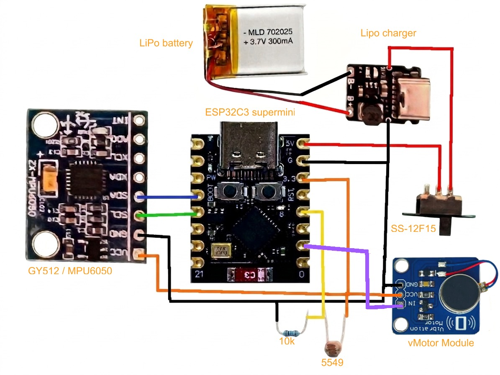

| 步驟 | 連接點 A | 連接點 B | 說明 |
| :---: | :--- | :--- | :--- |
| 1 | 外部 5V 電源 | ESP32-C3 5V 輸入端 | 為開發板提供電源 |
| 2 | ESP32-C3 3.3V | MPU-6050 VCC、光敏電阻一端、震動馬達正極 | 提供電源給 MPU-6050、光敏電阻分壓電路及震動馬達 |
| 3 | ESP32-C3 GND | 所有零件 GND（馬達、感測器、電晶體等） | 全部共地，形成完整迴路 |
| 4 | ESP32-C3 GPIO 1 | 震動馬達模組 IN | 輸出震動馬達控制訊號 |
| 5 | 光敏電阻 另一端 | GPIO 3 及 10kΩ 電阻 一端 | 分壓電路中間節點（ADC 讀取點） |
| 6 | 10kΩ 電阻 另一端 | ESP32-C3 GND | 分壓電路下端接地 |
| 7 | MPU-6050 SDA 腳位 | ESP32-C3 GPIO 8 | I2C 資料線 |
| 8 | MPU-6050 SCL 腳位 | ESP32-C3 GPIO 9 | I2C 時脈線 |
| 9 | MPU-6050 GND 腳位 | ESP32-C3 GND | 感測器接地 |

電路小提示：

# ESP32-C3 震動馬達模組 + 光敏電阻 驅動電路 (GPIO 1 控制馬達)

## 震動馬達模組驅動接線（GPIO 1）

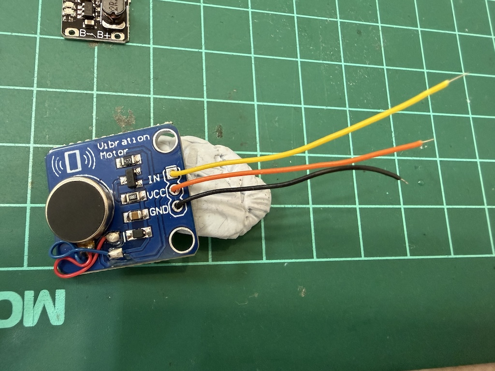

## 電路運作原理

- **GPIO 1 輸出高電平（3.3V）** → 模組內三極管基極獲得足夠電流 → 電晶體飽和導通 → 馬達獲得電流而振動。
- **GPIO 1 輸出低電平（0V）** → 電晶體截止 → 馬達停止。
- **續流二極體**：在馬達關斷瞬間，線圈產生反向感應電動勢（可達數十伏），二極體提供通路將其釋放，保護 三極管 不被擊穿。
- **光敏電阻**：光線越暗，阻值越大，分壓點電壓越高（ADC 數值越大）；光線越亮，阻值越小，電壓越低。

- NPN 電晶體開關原理是：電流從 C 流向 E（C → E），所以 負載（馬達）要接在 C 腳，E 腳要直接接地，這樣開關才能完全導通。

- 二極體 是反向並聯在馬達兩端（陰極接正極、陽極接負極），用來吸收馬達關斷時產生的「反向感應電動勢」，保護 三極管 不被高壓擊穿。

## 光敏電阻（光線感測）接線（GPIO 3）

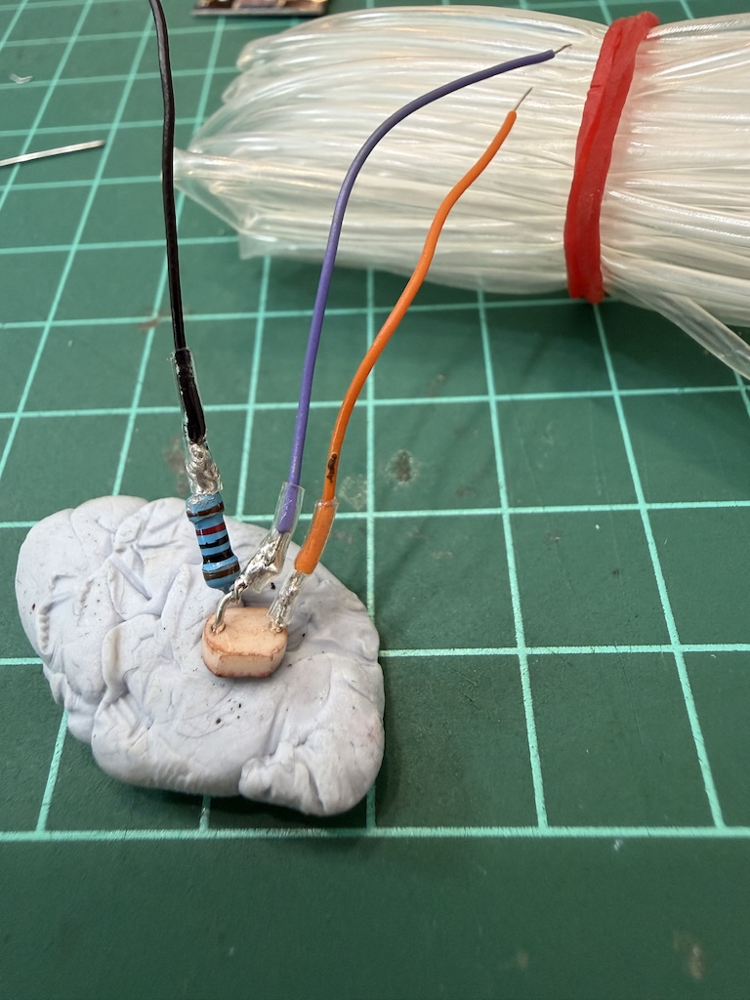

| 步驟 | 連接點 A | 連接點 B | 說明 |
| :---: | :--- | :--- | :--- |
| 1 | 光敏電阻 **一端** | ESP32-C3 **3.3V** | 分壓電路上端 |
| 2 | 光敏電阻 **另一端** | **10kΩ 電阻** 之一端 及 **GPIO 3** | 分壓節點（ADC 讀取點） |
| 3 | **10kΩ 電阻** 之另一端 | ESP32-C3 **GND** | 分壓電路下端 |

** 在焊接處加上熱縮通絕緣 **

## 為什麼需要「分壓電路」？

- ESP32-C3 的 ADC（類比數位轉換器）**只能讀取電壓（0~3.3V）**，無法直接讀取電阻值。
- 光敏電阻是一個**可變電阻**，單獨接到 GPIO 時，因 GPIO 輸入阻抗極高，幾乎無電流流過，電壓恆為 3.3V，無法感測變化。
- 因此必須串聯一顆固定電阻（10kΩ），形成電流迴路，根據歐姆定律，分壓點電壓會隨光敏電阻阻值變化而改變，ADC 才能讀出有意義的數值。
- 選用 **10kΩ** 是常見工程值，因典型光敏電阻在室內光下約 10k~20kΩ，此組合能使輸出電壓變化範圍最大且線性度佳。

## MPU6050（陀螺儀）I2C接線（GPIO 8 SDA, GPIO 9 SCL）

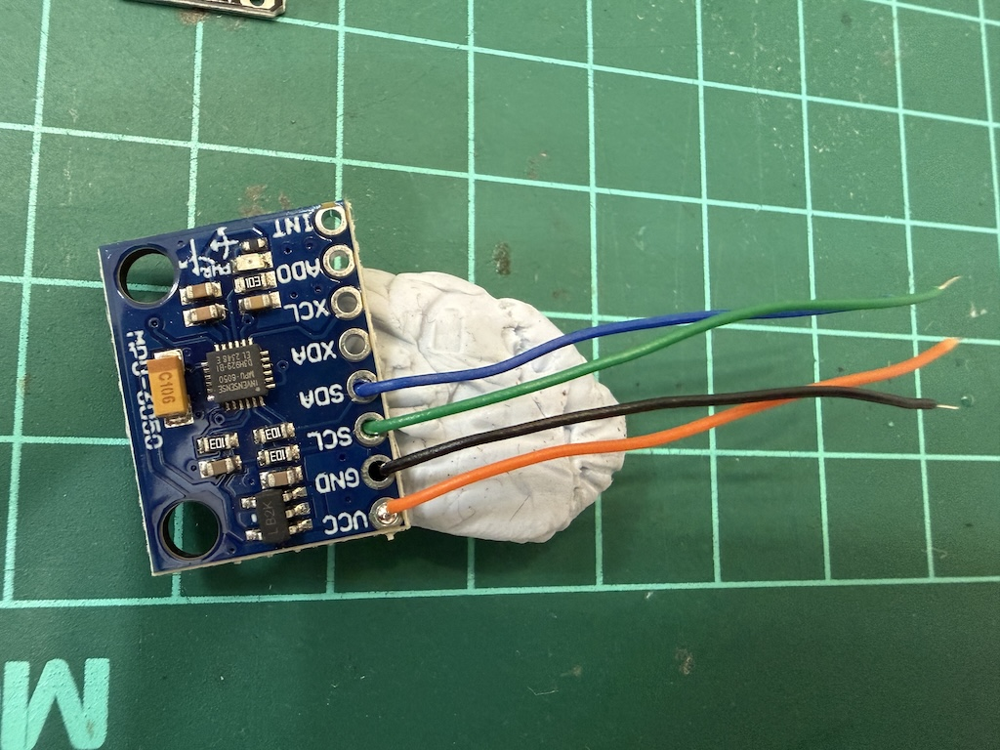

## ESP32C3 以及 電源：

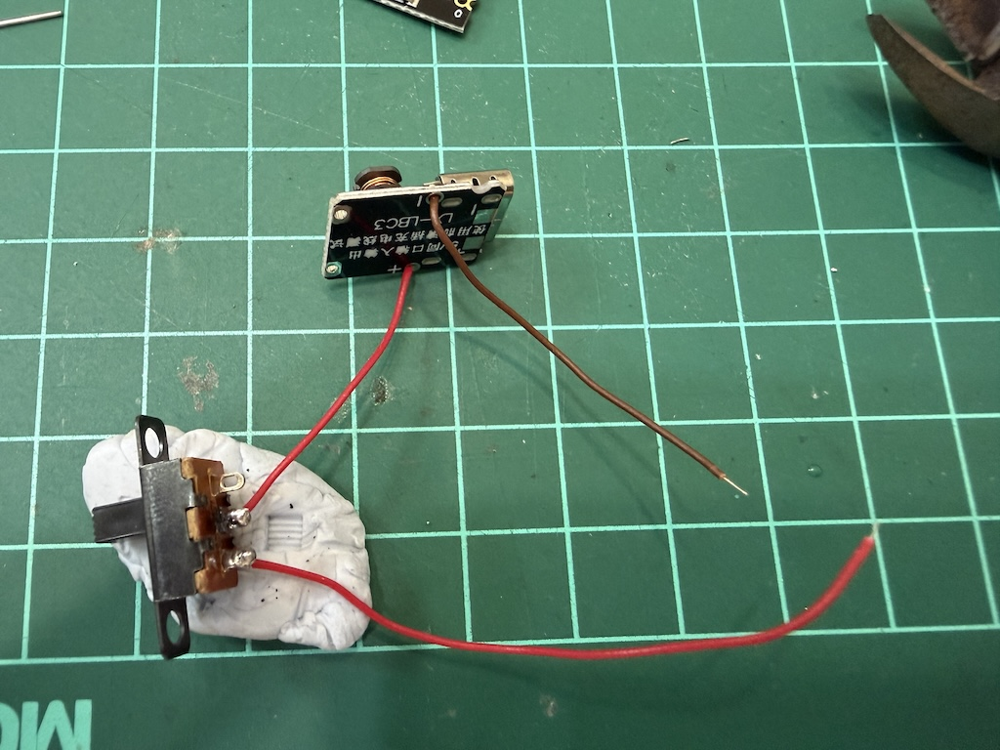

- 引出充電模組的 OUT- 和 OUT+ 經過「電源開關」。

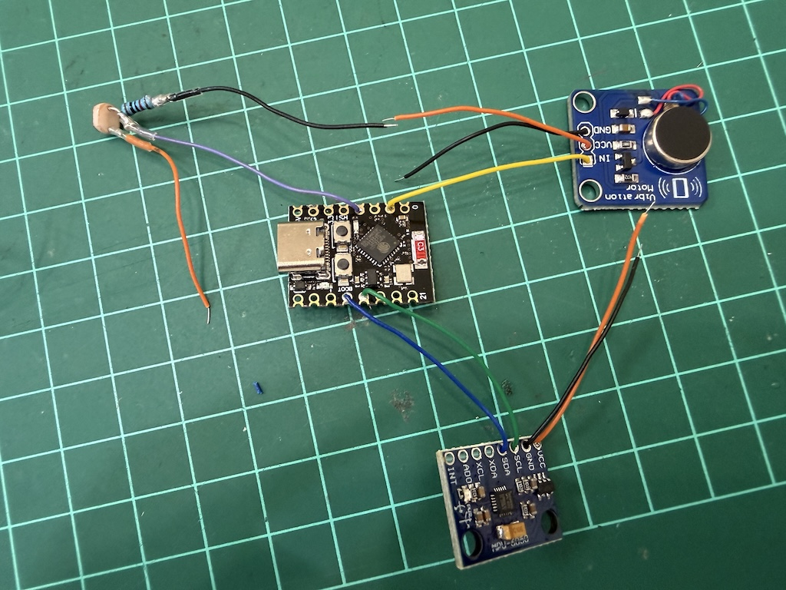

- MPU6050 SDA > 8，SCL > 9 。 震動馬達模組 IN > 1 。 光敏電阻 > 3 。

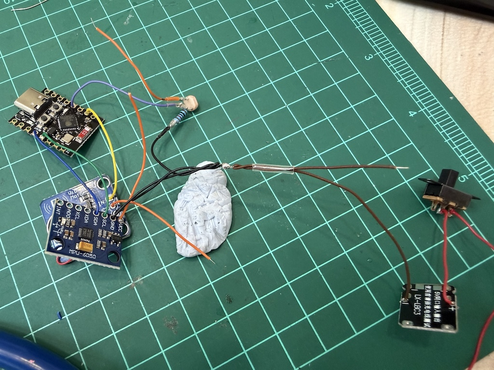

- 充電模組的 OUT- 連接 MPU6050、震動馬達模組、光敏電阻 負極 並且引出 預留接駁ESP32C3 負極。

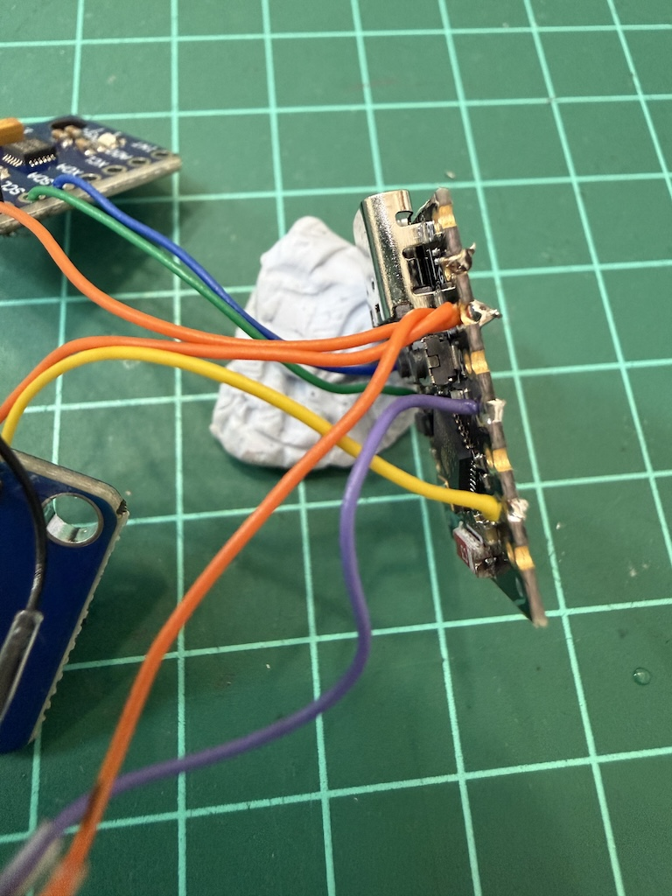

- MPU6050、震動馬達模組、光敏電阻 正極連接 ESP32C3 3.3V

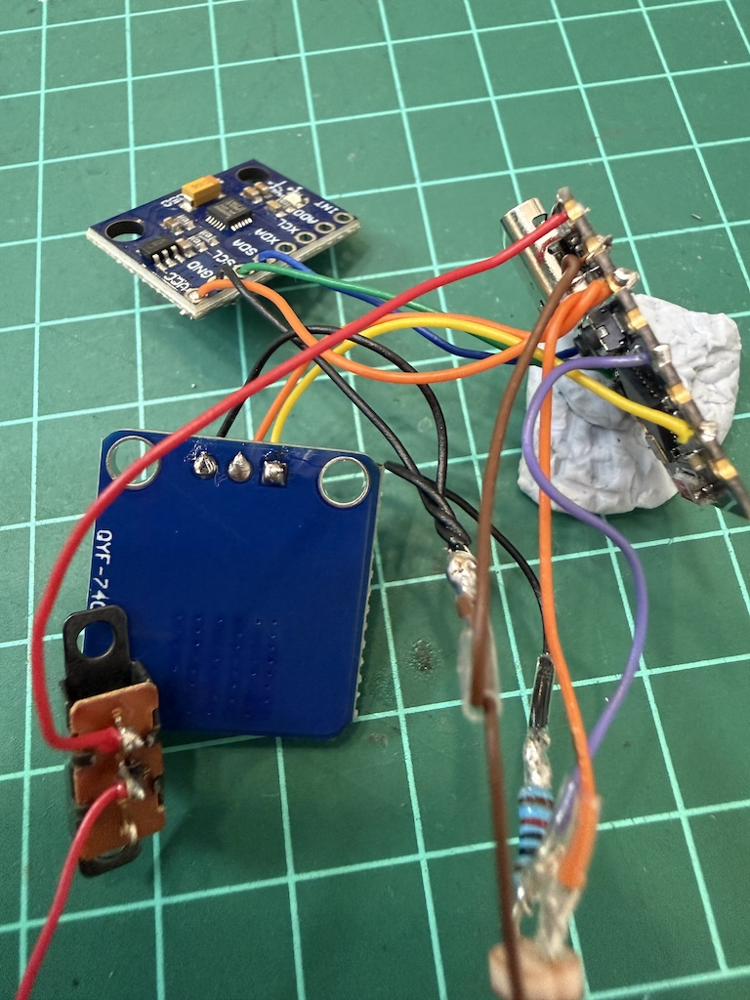

- OUT+經過「電源開關」接到 ESP32-C3 的 5V ，共地負極接駁ESP32C3 負極。
  

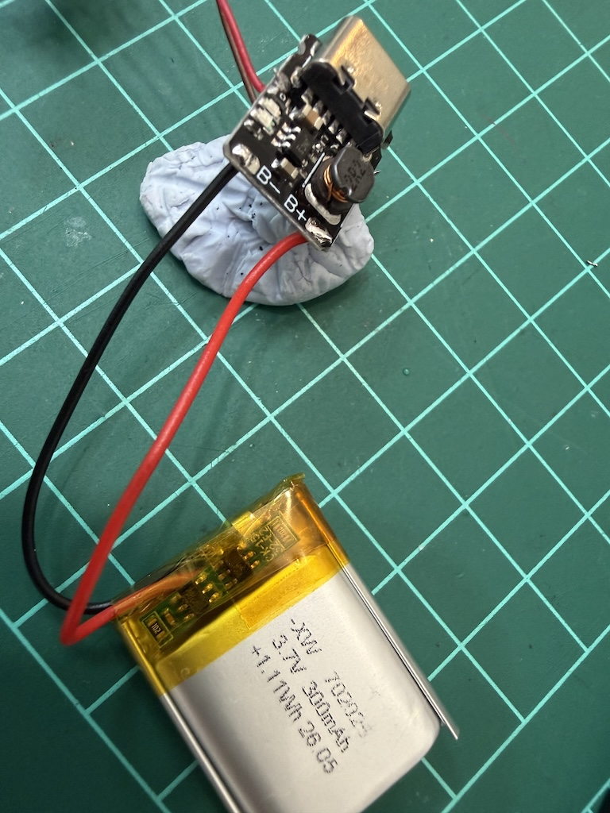

- 最後鋰電池透過「充電模組」的 BAT+ 和 BAT- 連接。
  

# 2. 3D 列印外殼

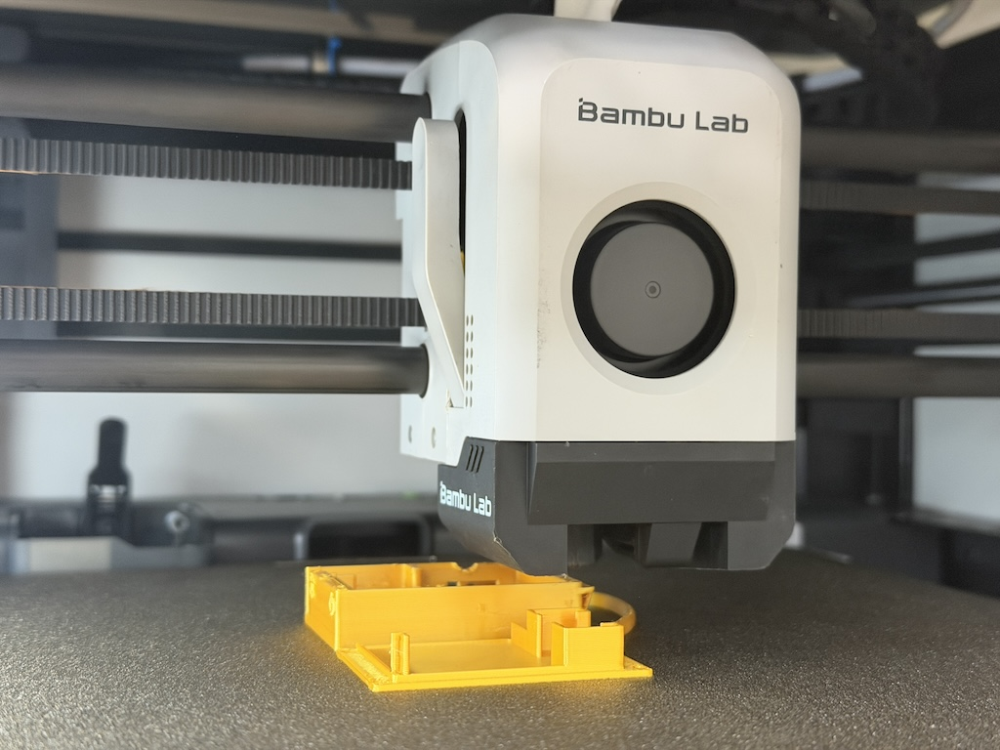
請使用以下建議設定列印外殼。STL 檔案可以在 hardware/3d_print/ 資料夾中找到。

材料：PLA 或 PLA+ (約 10g)

噴嘴直徑：0.4mm

層高：0.28mm

外牆層數 (Wall Loops)：3

填充率：20%

支撐：不需要支撐。

備有大小掛耳，適配不同人士使用。

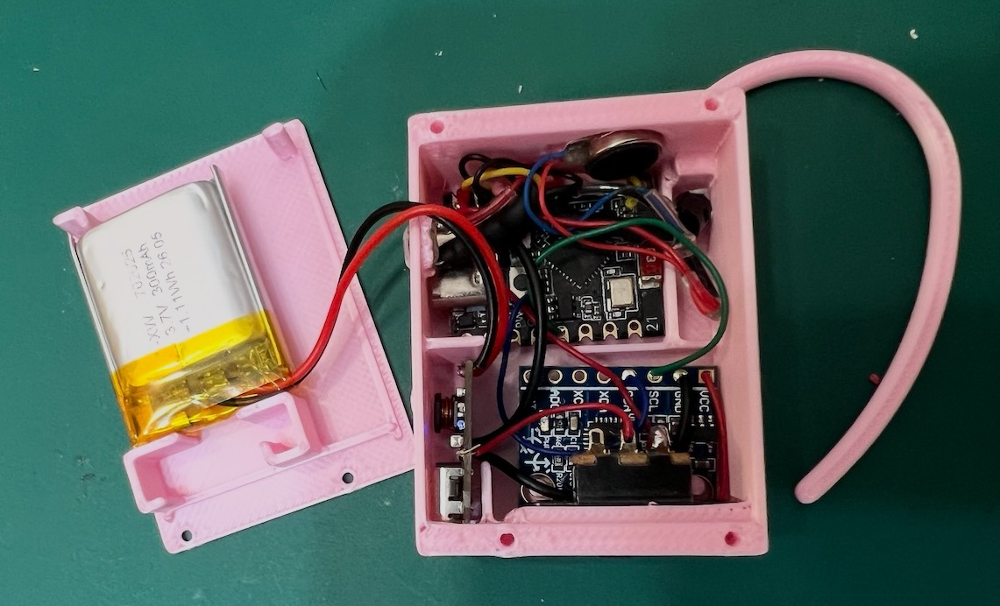

# 3. 軟體燒錄 (韌體)
韌體使用 C++ 編寫，在 Arduino IDE 中開發。

安裝 Arduino IDE：從 官方網站 下載並安裝。

安裝 ESP32 開發板套件：

開啟 Arduino IDE，進入 檔案 > 偏好設定。

在「額外的開發板管理器網址」中，加入：https://espressif.github.io/arduino-esp32/package_esp32_index.json

進入 工具 > 開發板 > 開發板管理員，搜尋 esp32 並安裝 esp32 套件。

安裝所需的程式庫：

在 草稿碼 > 匯入程式庫 > 管理程式庫 中，搜尋並安裝：

MPU6050 by Electronic Cats (或 Adafruit MPU6050)

ESP32 BLE Arduino (通常已內建)

開啟韌體專案：

下載本倉庫的程式碼，在 Arduino IDE 中開啟 firmware/neGuard_v2.ino 檔案。

選擇開發板與連接埠：

在 工具 > 開發板 中，選擇 ESP32C3 Dev Module。

在 工具 > 連接埠 中，選擇你的 ESP32-C3 對應的 COM 連接埠。

上傳程式碼：

點擊 「上傳」 按鈕。等待編譯並上傳完成。

# 📱 使用說明
下載手機應用程式：在 Google Play 或 App Store 商店搜尋並下載 「NeckEase 頸智鬆」。

開啟裝置電源：將 neGuard 的電源開關撥至「ON」位置。

配對與設定：

打開手機應用程式，點擊「姿態提示」功能。

按下螢幕右上方"藍牙"標誌，會自動掃描附近的 neGuard 裝置，點擊進行配對。

依照手機畫面上的引導，設定提醒的「角度閾值」和「持續時間」。

開始使用：設定完成後，將 neGuard 夾在(左)耳朵上。當你的頭部前傾角度超過設定值且持續時間過長時，neGuard 便會震動提醒你。此後，即使手機不在身邊，neGuard 也能獨立工作。

** 與應用程式配對及設定之後，neGuard 保留參數儲存到 EEPROM，neGuard 開機30秒後會停止藍牙功能節省電力。如改動「角度閾值」和「持續時間」，在neGuard開機30秒內打開手機應用程式重新設定。 **

# 📜 授權資訊
本專案 (包含韌體、硬體設計檔案、3D 列印檔案) 採用 MIT License 開源授權。

這意味著你可以：

✅ 自由使用、複製、修改、合併、出版發行、散布、再授權及販售軟體及硬體檔案的副本。

✅ 將本專案用於任何用途，包括商業用途。

唯一的條件是：你必須在所有的副本或重要部分中，包含版權聲明及本許可聲明。

詳細授權條款請參閱本倉庫的 LICENSE 檔案。

# 🤝 如何貢獻
我們非常歡迎任何形式的貢獻！如果你有好的想法、發現了 Bug，或是想改善文件，歡迎：

Fork 本專案。

建立你的功能分支 (git checkout -b feature/AmazingFeature)。

提交你的修改 (git commit -m 'Add some AmazingFeature')。

推送至分支 (git push origin feature/AmazingFeature)。

開啟一個 Pull Request。

祝你組裝愉快，輕鬆告別烏龜頸！
